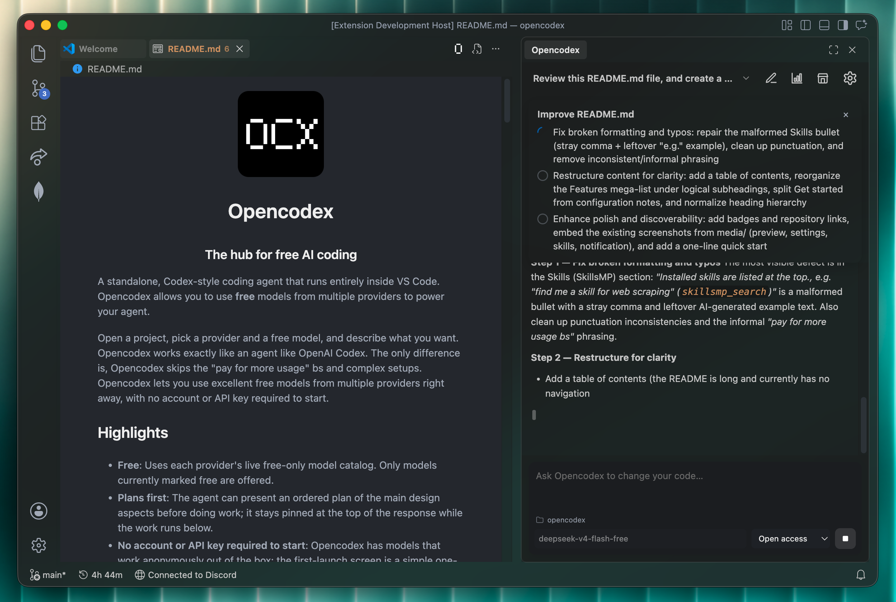
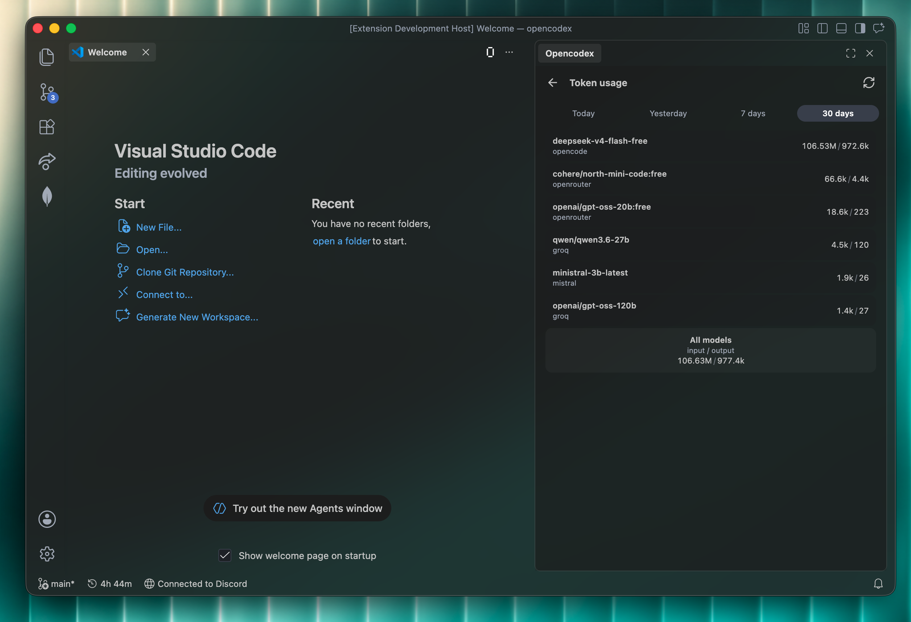
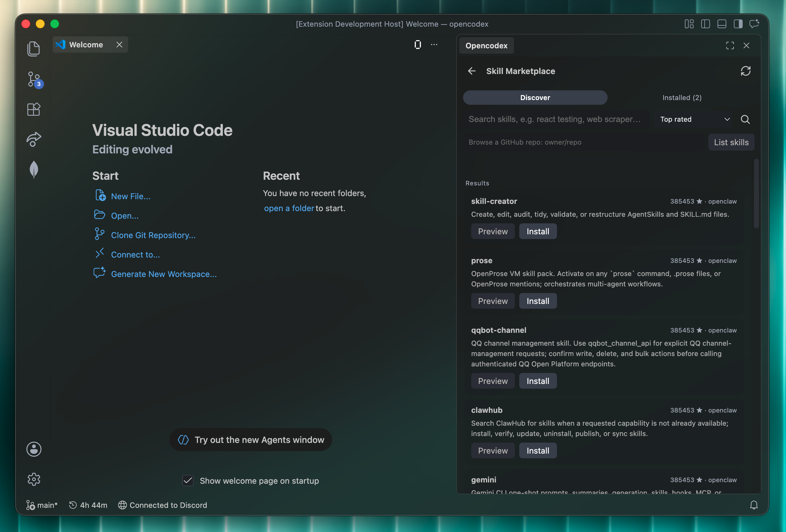
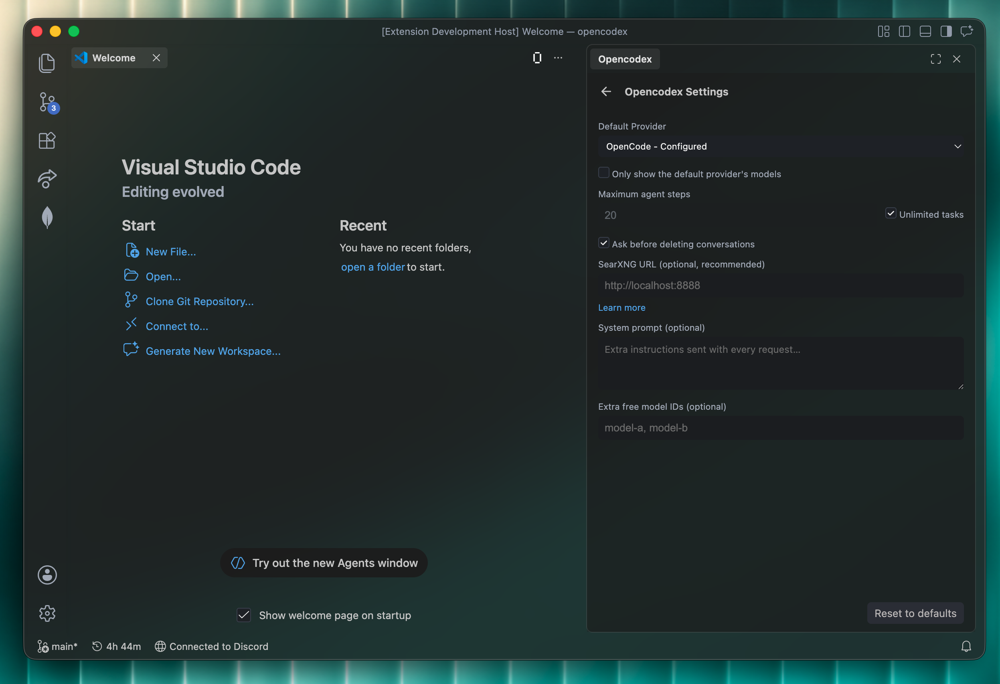

<p align="center">
  
</p>

<h1 align="center">Opencodex</h1>
<p align="center"><strong>A free, open-source coding agent inside VS Code.</strong></p>
<p align="center">Start without an account or API key, connect another free provider, or run models locally with Ollama.</p>

<p align="center">
  <a href="https://marketplace.visualstudio.com/items?itemName=EvaanChowdhry.opencodex-agent"></a>
  <a href="https://marketplace.visualstudio.com/items?itemName=EvaanChowdhry.opencodex-agent"></a>
  <a href="https://github.com/matonhp5108/Opencodex/stargazers"></a>
  <a href="LICENSE"></a>
</p>

<p align="center">
  <strong><a href="https://marketplace.visualstudio.com/items?itemName=EvaanChowdhry.opencodex-agent">Install from the VS Code Marketplace</a></strong>
  ·
  <a href="https://github.com/matonhp5108/Opencodex/issues">Report a bug or request a feature</a>
</p>



Opencodex brings a Codex-style agent loop to the editor you already use. Open a folder, choose a free model, and describe the outcome you want. The agent can inspect the repository, plan the work, edit files, run commands, and show every step as it happens.

## Contents

- [Why Opencodex](#why-opencodex)
- [Quick start](#quick-start)
- [What it can do](#what-it-can-do)
- [Model providers](#model-providers)
- [Safety and approvals](#safety-and-approvals)
- [MCP, subagents, terminals, and memory](#mcp-subagents-terminals-and-memory)
- [Skills marketplace](#skills-marketplace)
- [Settings](#settings)
- [Commands](#commands)
- [Development](#development)

## Why Opencodex

- **Free to start:** OpenCode works anonymously out of the box. No Opencodex account or API key is required.
- **Bring your own provider:** Switch between OpenCode, OpenRouter, Groq, Gemini, Mistral, and Ollama.
- **Local models:** Use compatible models installed in Ollama without sending prompts to a cloud model provider.
- **Visible agent work:** Follow plans, reasoning, tool activity, retries, and streamed answers from the sidebar.
- **Workspace-aware:** Each folder gets its own project and conversation history.
- **Built for recovery:** Editor undo and Git restore points make agent changes easier to inspect and roll back.
- **Extensible with skills:** Discover, preview, and install `SKILL.md` packages from SkillsMP or GitHub.
- **Your choice of control:** Confirm every action, auto-approve edits, or enable Open access.

## Quick start

1. [Install Opencodex from the VS Code Marketplace](https://marketplace.visualstudio.com/items?itemName=EvaanChowdhry.opencodex-agent).
2. Open a folder in VS Code.
3. Click the **O** button in the editor title bar, or run **Opencodex: Open Chat** from the Command Palette.
4. Complete the one-time setup. The default OpenCode provider needs no account or API key.
5. Pick a free model below the composer and describe what you want to build.

That is enough to begin. API keys, Ollama, SkillsMP, and SearXNG are optional.

## What it can do

### Work like a coding agent

- Read and search the active workspace
- Create, edit, and delete files within the workspace boundary
- Review proposed file diffs before they are applied in Ask mode
- Run commands with configurable approvals
- Keep named shell sessions alive for dev servers and interactive follow-up commands
- Delegate bounded exploration, review, and implementation work to subagents
- Use tools exposed by configured MCP servers
- Present a pinned plan before beginning multi-step work
- Stream answers while showing collapsible tool and reasoning details
- Schedule one follow-up prompt and steer an active run
- Retry interrupted model streams instead of silently claiming completion

### Keep projects organized

- Maintain separate chat history for every VS Code folder
- Switch, archive, restore, and permanently delete conversations
- Copy messages and review timestamps
- Restore Git-tracked files to the state captured after an agent response
- Receive native completion, approval, and failure notifications
- Review token usage by model and provider
- Keep durable project decisions in `.opencodex/memory.md`



## Model providers

Every provider uses the same agent experience. Keys are stored separately for each provider in VS Code SecretStorage and are never written to `settings.json`.

| Provider                 | API key | Models offered                                                       |
| ------------------------ | ------- | -------------------------------------------------------------------- |
| **OpenCode** _(default)_ | No      | Compatible models ending in `-free`, loaded from the live catalog    |
| **OpenRouter**           | Yes     | Compatible models ending in `:free`, loaded from the live catalog    |
| **Groq**                 | Yes     | Compatible models in Groq's free tier                                |
| **Google Gemini**        | Yes     | Compatible Gemini and Gemma free-tier models                         |
| **Mistral**              | Yes     | Known free-tier models, with support for extra model IDs in Settings |
| **Ollama** _(local)_     | No      | Compatible models installed on your machine                          |

Cloud free tiers have their own rate limits and availability can change without an Opencodex release. Reopen Settings to refresh the model list. Opencodex filters out non-chat and non-tool-capable models where provider metadata allows it.

## Safety and approvals

Opencodex constrains its built-in file tools to the active workspace. Common credential files such as `.env` are blocked, and provider API keys are kept in VS Code's encrypted SecretStorage.

| Mode            | File edits | Commands                | Destructive commands |
| --------------- | ---------- | ----------------------- | -------------------- |
| **Ask**         | Confirm    | Confirm                 | Confirm              |
| **Auto edits**  | Automatic  | Safe commands automatic | Confirm              |
| **Open access** | Automatic  | Automatic               | Automatic            |

In Ask mode, Opencodex opens a VS Code diff containing the proposed content before asking you to apply or reject it. Applied edits use VS Code workspace edits and participate in editor undo. Open access is intentionally powerful; use it only in workspaces where you are comfortable allowing unattended commands.

## MCP, subagents, terminals, and memory

Configure MCP servers in the Settings MCP picker, sort of like ChatGPT plugins. Opencodex can use multiple servers at once, and each server can expose multiple tools. The agent can call any tool from any server, and the tool's output is streamed back to the sidebar.

Each MCP tool is namespaced by server and follows the active approval mode. Connections are opened for the agent run and closed afterward.

The agent can delegate a bounded task to an **explorer**, **reviewer**, or **worker** subagent. Explorer and reviewer subagents are read-only; worker subagents can edit and verify through the same approval system as the parent.

Named persistent shell sessions remain alive across tool calls and conversations until they are explicitly stopped or the extension closes. Project memory is stored in `.opencodex/memory.md`, loaded into future requests, and editable with **Opencodex: Open Project Memory** from the Command Palette.

## Skills marketplace

Opencodex can extend itself with `SKILL.md` packages from [SkillsMP](https://skillsmp.com) or a GitHub repository.



- **Discover:** Search popular or recently updated skills from the shop button beside Settings.
- **Preview:** Read a skill's instructions and inspect its GitHub source before installation.
- **Install:** Add the selected skill to Opencodex's global extension storage after approval.
- **Use anywhere:** Installed skills are available across workspaces and added to the agent's instructions from the next request.

You can also ask directly: _“Find me a skill for web scraping”_ or _“Install the planning skill from `owner/repository`.”_

## Settings

Open the gear button in the Opencodex sidebar or run **Opencodex: Open Settings**.



| Setting                         | Purpose                                                |
| ------------------------------- | ------------------------------------------------------ |
| `opencodex.provider`            | Active model provider                                  |
| `opencodex.model`               | Selected compatible free model                         |
| `opencodex.maxSteps`            | Maximum tool-loop steps; `0` allows unlimited steps    |
| `opencodex.approvalMode`        | Ask, Auto edits, or Open access                        |
| `opencodex.searxngUrl`          | Optional SearXNG instance used by the web-search tool  |
| `opencodex.mcpServers`          | JSON configuration for stdio, HTTP, or SSE MCP servers |
| `opencodex.extraFreeModels`     | Additional comma-separated model IDs to show           |
| `opencodex.systemNotifications` | Native task, approval, and failure notifications       |

### Optional web search

Set a SearXNG base URL to enable the `web_search` tool. The server must allow JSON output with `format=json`.

- Local VS Code: `http://localhost:8888`
- Dev Containers or remote workspaces: use an address reachable from the extension host, such as the host LAN address or `host.docker.internal` where supported

See the [SearXNG installation documentation](https://docs.searxng.org/admin/installation.html) for setup options.

## Commands

| Command                               | Description                                         |
| ------------------------------------- | --------------------------------------------------- |
| `Opencodex: Open Chat`                | Open Opencodex in the secondary sidebar             |
| `Opencodex: Focus Chat`               | Focus the current chat                              |
| `Opencodex: Open Settings`            | Open provider and agent settings                    |
| `Opencodex: Show Token Usage`         | Review recent input and output token usage          |
| `Opencodex: Open Project Memory`      | Open the active folder's durable memory file        |
| `Opencodex: Skill Marketplace`        | Browse, preview, and install skills                 |
| `Opencodex: New Chat`                 | Start a new conversation                            |
| `Opencodex: Test System Notification` | Verify native notifications on the current platform |

## Requirements

- VS Code **1.106.0** or newer
- An internet connection for cloud providers
- Optional: a free provider API key for OpenRouter, Groq, Gemini, or Mistral
- Optional: Ollama for fully local models
- Optional: SearXNG for web search

## Development

```bash
git clone https://github.com/matonhp5108/Opencodex.git
cd Opencodex
npm install
npm run check
npm run build
```

Open the folder in VS Code and press `F5` to launch an Extension Development Host.

```bash
npm run package
```

The package command type-checks the project, builds the extension, and creates a `.vsix` with `vsce`.

## Known limitations

- Free-model catalogs and rate limits are controlled by each provider.
- Mistral does not expose a free-model marker, so its built-in list is curated.
- Web search requires a user-provided SearXNG instance.
- Skills search and installation use SkillsMP and GitHub; unauthenticated GitHub API limits may apply.
- Restore points cover Git-tracked files and are available only for newer responses that captured a Git state.
- Persistent terminal sessions use piped shells rather than a full PTY, so full-screen terminal applications are not supported.

## Support and contributing

Bug reports and feature requests are welcome in [GitHub Issues](https://github.com/matonhp5108/Opencodex/issues). Include the Opencodex version, VS Code version, provider, and selected model when reporting model-specific problems.

Pull requests are welcome. Please run `npm run check` and `npm run build` before submitting changes.

## License

[MIT](LICENSE)

---

<p align="center">
  <sub>You made it to the end of the README. Here is your reward:</sub>
</p>

```
  ██████╗    ██████╗   ██╗  ██╗
 ██╔═══██╗  ██╔════╝   ╚██╗██╔╝
 ██║   ██║  ██║         ╚███╔╝
 ██║   ██║  ██║         ██╔██╗
 ╚██████╔╝  ╚██████╗   ██╔╝ ██╗
  ╚═════╝    ╚═════╝   ╚═╝  ╚═╝
```

<p align="center">
  <sub><strong>Opencodex</strong> - keep building.</sub>
</p>
